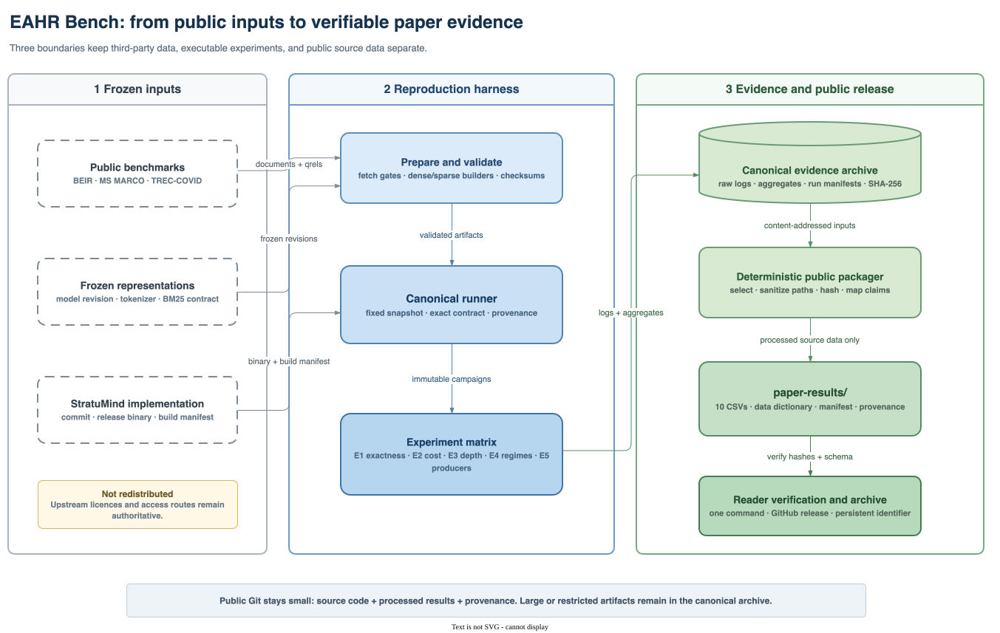

# Exact Adaptive Hybrid Retrieval (EAHR)

[](https://doi.org/10.48550/arXiv.2608.07152)
[](https://github.com/ln-one/exact-adaptive-hybrid-retrieval/actions/workflows/verify.yml)
[](https://github.com/ln-one/exact-adaptive-hybrid-retrieval/releases)
[](LICENSE)

Code, reproducible experiments, and processed result data for **Exact Adaptive
Hybrid Retrieval Without Fixed Top-L Cutoffs**.

Paper: [arXiv:2608.07152](https://arxiv.org/abs/2608.07152) ·
[DOI: 10.48550/arXiv.2608.07152](https://doi.org/10.48550/arXiv.2608.07152)

This repository keeps three concerns separate: licensed upstream inputs,
executable experiments, and the compact evidence that readers can inspect
without downloading corpora or rebuilding indexes.



The editable source for this diagram is
[`docs/assets/eahr-bench-architecture.drawio`](docs/assets/eahr-bench-architecture.drawio).

## Start here

| Goal | Entry point | Needs large artifacts? |
| --- | --- | --- |
| Inspect the data behind the paper | [`paper-results/`](paper-results/) | No |
| Verify every published CSV and checksum | `uv run python scripts/verify_public_paper_results.py` | No |
| Understand the evidence contract | [`docs/canonical-data-protocol.md`](docs/canonical-data-protocol.md) | No |
| Reproduce an experiment | [`scripts/run_canonical.py`](scripts/run_canonical.py) | Yes |

The corresponding Qdrant-based retrieval implementation is maintained in
[StratuMind](https://github.com/ln-one/StratuMind). Publication runs identify
that implementation by commit, binary digest, and build manifest; a branch tip
is never treated as an experimental identifier.

## Repository map

```text
paper-results/                 processed paper data, schemas, hashes, provenance
scripts/run_canonical.py       publication experiment runner
scripts/build_public_*.py      deterministic public-package builder
scripts/verify_public_*.py     reader-side package verifier
docs/                          data contracts, use register, architecture source
tests/                         source and evidence-package checks
datasets.toml                  dataset registry and artifact layout
```

The repository does **not** redistribute benchmark corpora, model caches,
vector indexes, or raw run logs. Those remain under their upstream terms in a
caller-selected artifact root outside Git.

## Verify the public package

With Python 3.11--3.13 and [`uv`](https://docs.astral.sh/uv/) installed:

```bash
uv sync --frozen
uv run python scripts/verify_public_paper_results.py
uv run python -m unittest discover -s tests
```

These checks need no datasets or models. They validate the ten processed CSVs,
their schemas and row counts, SHA-256 checksums, the sanitized source-evidence
index, and the absence of absolute local paths.

## Experiment scope

The canonical harness covers:

- **E1** — ordered-result parity with complete-list weighted RRF;
- **E2** — paired execution-cost and latency comparisons;
- **E3** — fixed-depth effectiveness and ranking agreement;
- **E4** — controlled rank-stream regimes;
- **E5** — exact dense and sparse rank-generator comparisons;
- temporal target-validity experiments over TREC-COVID snapshots.

Dense vectors, sparse impacts, system binaries, and hardware records are frozen
by generated manifests. See
[`docs/canonical-data-protocol.md`](docs/canonical-data-protocol.md) for the
full evidence contract and [`docs/data-use-register.md`](docs/data-use-register.md)
for dataset access and redistribution boundaries.

## Prepare an artifact root

Full reproduction additionally requires JDK 21, the separately locked
Pyserini environment, a clean checkout of the recorded StratuMind revision,
and sufficient local storage.

```bash
export EAHR_ARTIFACT_ROOT=/path/to/eahr-artifacts/canonical-v1
mkdir -p "$EAHR_ARTIFACT_ROOT"

uv run python scripts/estimate_storage.py --root "$EAHR_ARTIFACT_ROOT"
uv run python scripts/fetch_beir.py \
  --root "$EAHR_ARTIFACT_ROOT" \
  --dataset nfcorpus
```

Large archives are never selected implicitly. BEIR availability is not treated
as a license grant.

The portable non-negative sparse representation is built in the isolated
sparse environment:

```bash
JAVA_HOME=/path/to/jdk-21 \
PATH=/path/to/jdk-21/bin:$PATH \
.venv-sparse/bin/python scripts/build_lucene_bm25.py \
  --artifact-root "$EAHR_ARTIFACT_ROOT" \
  --dataset nfcorpus
```

## Run a canonical check

After preparing and loading a collection, E1 obtains exact dense and sparse
rankings, applies the frozen weighted-RRF and tie-order contract, and compares
that oracle with the StratuMind response:

```bash
uv run python scripts/run_canonical.py e1 \
  --artifact-root "$EAHR_ARTIFACT_ROOT" \
  --dataset nfcorpus \
  --collection ed-wrrf-nfcorpus \
  --system-repo /path/to/frozen/StratuMind \
  --system-artifact sha256:<binary-or-container-digest> \
  --output /path/to/results/e1-nfcorpus.jsonl

uv run python scripts/validate_canonical_log.py \
  /path/to/results/e1-nfcorpus.jsonl
```

Canonical execution rejects dirty source repositories by default.
`--allow-dirty` is a development escape hatch; it marks records dirty and makes
them ineligible for publication validation. E1 includes correctness-oracle
work and must not be reported as E2 performance latency.

The clean E5-v2 counterbalanced campaign also requires a unique run label:

```bash
bash scripts/run_e5_v2_counterbalanced_overnight.sh \
  "$EAHR_ARTIFACT_ROOT" \
  /path/to/frozen/StratuMind \
  e5-v2-clean-YYYYMMDD
```

## Rebuild the compact result package

Readers normally use the checked-in package. Maintainers with the private paper
tree and canonical evidence archive can reproduce it deterministically:

```bash
uv run python scripts/build_public_paper_results.py \
  --paper-root /path/to/stratumind-paper \
  --artifact-root /path/to/eahr-artifacts/canonical-v1 \
  --verify-sources
```

`--verify-sources` re-hashes every indexed frozen input. It is separate from
reader-side verification because the large inputs are not redistributed.

## Provenance status

The checked-in E5-v2 measurements retain their original dirty-source flag;
they are not silently relabeled. Their recorded runner hashes match the later
committed harness, while a new clean-checkout rerun is maintained as a separate
campaign. The exact scope and interpretation are documented in
[`paper-results/PROVENANCE_NOTES.md`](paper-results/PROVENANCE_NOTES.md).

## License and citation

Harness code is licensed under Apache-2.0. Author-generated processed data in
`paper-results/derived/` is licensed under CC BY 4.0; neither license applies to
third-party corpora, models, or other upstream artifacts. See
[`paper-results/LICENSE.md`](paper-results/LICENSE.md) and
[`CITATION.cff`](CITATION.cff).

The DOI above identifies the paper. A separate DOI for a frozen software and
processed-data release will be added after the GitHub release is archived.
